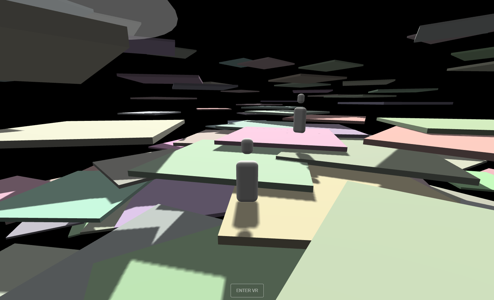

# WebXRNodeLab_eCampus21

WebXRNodeLab_eCampus21 is a project template for building multi-user WebXR spaces using Three.js (client side) and Node.js (server side). 

An example project using the template can be visited at [https://webxrnodelab.herokuapp.com/](https://webxrnodelab.herokuapp.com/)

Image shows a screenshot of the example project, showing two visitor avatars in a shared navigable world of cuboid objects, and the "Enter VR" button for viewing in VR.

## Sister projects

This is one of three projects developed in parallel by OCAD University and York University researchers with the goal of providing students of varying educational backgrounds and skillsets with the necessary toolkits to quickly produce WebXR envrironments for their creative media projects:

- [WebXR Template for Three.js and Node.js](https://github.com/worldmaking/WebXRNodeLab_eCampus21)
- [WebXR Template for P5.js](https://github.com/worldmaking/WebXR_P5js_eCampus21)
- [WebXR Template for A-Frame](https://github.com/ocadwebxr/ocadu-open-webxr)

## Acknowledgements

This project is made possible with funding by the Government of Ontario and through eCampusOntario’s support of the Virtual Learning Strategy. To learn more about the Virtual Learning Strategy visit: https://vls.ecampusontario.ca.

## License

WebXRNodeLab_eCampus21 by The Alice Lab at York University is licensed under the GNU General Public License v3.0, except where otherwise noted.

[Three.js is shared under the MIT license](https://github.com/mrdoob/three.js/blob/dev/LICENSE)

# User Manual

